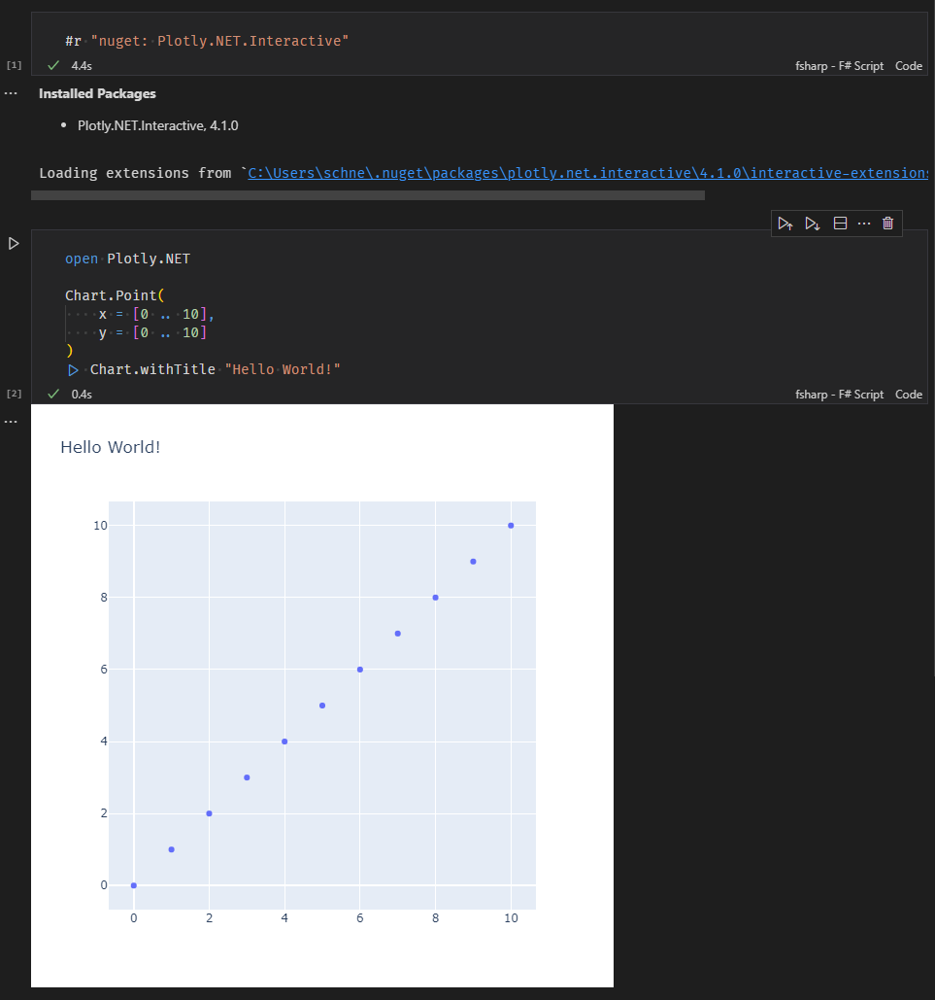

[](https://github.com/plotly/Plotly.NET/actions/workflows/build-and-test.yml)
[](https://www.nuget.org/packages/Plotly.NET/)
[](https://discord.gg/k3kUtFY8DB)

[](https://doi.org/10.12688/f1000research.123971.1)

### Table of contents 

- [What is Plotly.NET?](#what-is-plotlynet)
- [Installation](#installation)
- [Documentation](#documentation)
  - [Quick starts](#quick-starts)
    - [F#](#f)
    - [C#](#c)
  - [Samples and tutorials](#samples-and-tutorials)
  - [Full library reference](#full-library-reference)
- [Development](#development)
    - [build](#build)
    - [running and writing tests](#running-and-writing-tests)
    - [docs](#docs)
  - [Contributors](#contributors)
  - [Library license](#library-license)
- [FAQ](#faq)

# What is Plotly.NET?

Plotly.NET is an Interactive charting library for **.NET** programming languages 📈🚀. 

It is built on top of plotly.js and provides several API layers for creating, styling and rendering ✨**beautiful data visualizations**✨.

To get a deep-dive into the rationale behind the design choices of Plotly.NET, check out our [F1000Research paper](https://doi.org/10.12688/f1000research.123971.1)!


In short, Plotly.NET consists of multiple API layers and packages: 

- `Plotly.NET` - The core API is written in F# and provides multiple API layers to create and style charts - from the high-level, type-safe `Chart` API to low-level direct chart object manipulation. It is the foundation for all other packages.

- `Plotly.NET.Interactive` - This package provides interactive formatting extensions for .NET interactive notebooks.

- `Plotly.NET.ImageExport` - This package provides extensions for Plotly.NET to render charts as static images programmatically.

- `Plotly.NET.CSharp` - This package provides an idiomatic C# API. Note that you can use the core API in C#, this package just removes some friction at some places.
# Installation

You can get all Plotly.NET packages via nuget:

| Package Name| Nuget |
|---|---|
| Plotly.NET | [](https://www.nuget.org/packages/Plotly.NET/) |
| Plotly.NET.Interactive | [](https://www.nuget.org/packages/Plotly.NET.Interactive/) |
| Plotly.NET.ImageExport | [](https://www.nuget.org/packages/Plotly.NET.ImageExport/) |
| Plotly.NET.CSharp | [](https://www.nuget.org/packages/Plotly.NET.CSharp/) |

# Documentation

## Quick starts

### F#

In F# projects, just add the `Plotly.NET` package to your project and you are ready to go!

<details>
<summary> 📖 Polyglot Notebook 📖 Quick start</summary>

<br>

To enable Plotly.NET in a polyglot notebook, reference the `Plotly.NET.Interactive` package:

```fsharp
#r "nuget: Plotly.NET.Interactive"
```

To display a chart, just end a F# cell with it:

```fsharp
open Plotly.NET

Chart.Point(
    x = [0 .. 10],
    y = [0 .. 10]
)
|> Chart.withTitle "Hello World!"
```



</details>

<details>
<summary> .fsx Scripting quickstart</summary>

To enable Plotly.NET in a .fsx script, reference the `Plotly.NET` package:

```fsharp
#r "nuget: Plotly.NET"
```

To display a chart in your browser, use the `Chart.show` function:

```fsharp
open Plotly.NET

Chart.Point(
    x = [0 .. 10],
    y = [0 .. 10]
)
|> Chart.withTitle "Hello World!"
|> Chart.show
```

</details>

### C#

In C# projects, just add the `Plotly.NET.CSharp` package to your project and you are ready to go!

<details>
<summary> 📖 Polyglot Notebook 📖 Quick start</summary>

<br>

To enable Plotly.NET in a polyglot notebook for C#, reference the `Plotly.NET.Interactive` and `Plotly.NET.CSharp` packages:

```csharp
#r "nuget: Plotly.NET.Interactive"
#r "nuget: Plotly.NET.CSharp"
```

To display a chart, just end a C# cell with it:

```csharp
using Plotly.NET.CSharp;

Chart.Point<int, int, string>(
    x: Enumerable.Range(0,11),
    y: Enumerable.Range(0,11)
)
```

</details>

## Samples and tutorials

You can find extensive documentation with samples and tutorials of the core `Plotly.NET` library [📖 here](http://plotly.github.io/Plotly.NET/).

## Full library reference

The API reference for all packages is available [📚 here](http://plotly.github.io/Plotly.NET/reference/index.html)

The documentation for this library is automatically generated (using FSharp.Formatting) from *.fsx and *.md files in the docs folder. If you find a typo, please submit a pull request!

# Development

_Note:_ The `release` and `prerelease` build targets assume that there is a `NUGET_KEY` environment variable that contains a valid Nuget.org API key.

### build

Check the [build project](https://github.com/plotly/Plotly.NET/blob/dev/build) to take a look at the  build targets. Here are some examples:

```shell
# Windows

# Build only
./build.cmd

# Full release buildchain: build, test, pack, build the docs, push a git tag, publish the nuget package, release the docs
./build.cmd release

# The same for prerelease versions:
./build.cmd prerelease


# Linux/mac

# Build only
build.sh

# Full release buildchain: build, test, pack, build the docs, push a git tag, publísh the nuget package, release the docs
build.sh release

# The same for prerelease versions:
build.sh prerelease

```

### running and writing tests

please refer to the detailed readme in the [tests folder](./tests/README.md)

### docs

The docs are contained in `.fsx` and `.md` files in the `docs` folder. To develop docs on a local server with hot reload, run the following in the root of the project:

```shell
# Windows
./build.cmd watchdocs

# Linux/mac
./build.sh watchdocs
```

## Contributors 

Plotly.NET is a community maintained open source project. Big thanks to all contributors!

<a href="https://github.com/plotly/Plotly.NET/graphs/contributors">
  
</a>

## Library license

The library is available under the [MIT license](https://github.com/plotly/Plotly.NET/blob/dev/LICENSE).

# FAQ

<details>
<summary>Why are there two separate packages for C# and F#?</summary>

<br>

These packages are not separate, Plotly.NET.CSharp is built **on top** of Plotly.NET.

`Plotly.NET` (written in F#) is the main project. It is designed with interoperability in mind, and it is possible to use it from C#.

Over the years, some friction between F# and C# have surfaced that cannot be overcome in the F# codebase. For more info, take a look at this issue where we discuss the topic: https://github.com/plotly/Plotly.NET/issues/285

The `Plotly.NET.CSharp` package (written in C#, using the F# API internally) is a thin wrapper around the core API. It is not necessary to use it, but it can make the API more idiomatic and ergonomic for C# users.
</details>

<details>
<summary>Can I use Plotly.NET in [insert your UI library here]?</summary>

<br>

It depends. Plotly.NET creates JSON for consumption by the plotly.js library. The actual rendering is done by plotly.js, in an environment where javascript can be run. 

This means that your UI libs needs some way of displaying html and executing javascript to be compatible with Plotly.NET. That is true for most UI libs though, [here for example is a POC for Blazor](). 

For Windows Forms and WPF you could use a WebView control to display the charts.

You could also use Plotly.NET.ImageExport in your backend to create static images of your charts and serve those in your UI.
</details>